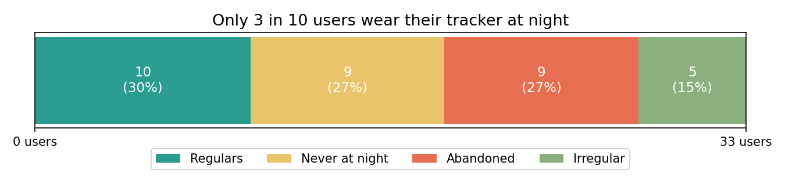
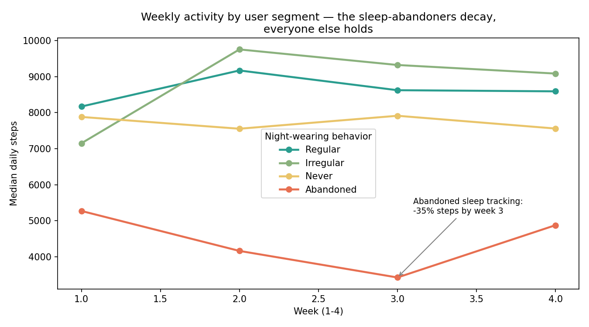
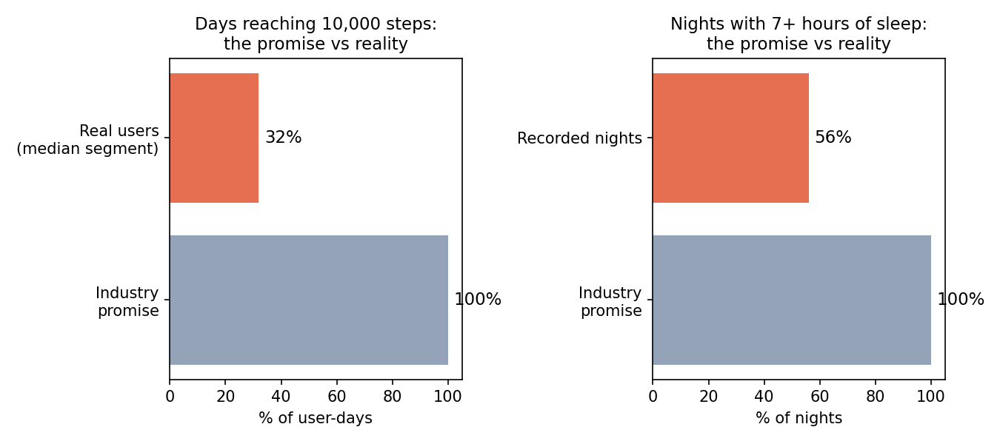

# Bellabeat Case Study — Turning Sleep into the Gateway to Retention

End-to-end marketing data analysis for a women's wellness brand
(Google Data Analytics Capstone): from business question to
executive report.

👉 **Full report:** `REPORT.md` — executive report, written for a
non-technical reader; every number traceable to an executed notebook cell.
👉 **Full code:** `bellabeat_analysis_final.ipynb` — the complete
executable notebook (data audit, cleaning, analysis, figures).

## Key findings
- Only 30% of users adopt sleep tracking durably (73% try it at least
  once) — and the only users whose activity declined over the month are
  the three who abandoned night wearing early.
- Four personas emerge — Completes (30%), Engaged day-only (27%),
  Inconsistent (33%), Decayers (9%) — one marketing message cannot speak
  to all four. The largest single block is the intermittent
  night-wearers: the interest exists, the habit does not.
- Reality sits far below industry benchmarks for most user-days: only
  40% of user-days reach 10,000 steps even for the most engaged segment
  (2% for decayers), and 44% of recorded nights are under 7 hours of sleep.
- Two natural daily contact windows sit outside the activity peak: the
  lunch plateau (12:00-14:00) and the evening wind-down (20:00-22:00) —
  activity peaks at 6 pm and collapses 53% after 8 pm.

## Deliverables
| File | Role |
|---|---|
| REPORT.md | Executive report, written for a non-technical reader |
| bellabeat_analysis_final.ipynb | Complete executable notebook (audit, cleaning, analysis, figures) |
| ASK.md → PREPARE.md → CLEANING_LOG.md → ANALYZE.md → SOURCES.md | Full analytical chain, every number traceable |
| 4 PNG figures | Presentation-grade charts, generated from the verified segmentation |

## Method
Ask → Prepare → Process → Analyze → Share (Google Data Analytics
cycle). Python (pandas, matplotlib) in a Kaggle notebook.

Discipline: findings are facts from a 33-user 2016 sample; market claims
are sourced separately; every recommendation carries its stated limit.
The dataset cannot describe women or today's market — it identifies
durable behavioral structures only. The segmentation rules (what counts
as "regular", "abandoned", "irregular") are stated explicitly in the
notebook and the cleaning log, so the analysis is auditable end to end.

## Data
FitBit Fitness Tracker Data (Möbius, Kaggle, CC0 Public Domain).
33 users verified (vs 30 announced by the Kaggle description — the
discrepancy is a documented data-quality finding), 2016-04-12 to
2016-05-12, 18 CSV files machine-verified.

## License
MIT (code and report). Dataset remains CC0.

