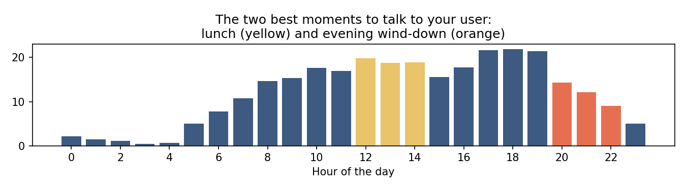

# Bellabeat: Turning Sleep into the Gateway to Retention
## How smart device behavior reveals three marketing opportunities

*Analysis report — Marketing Analytics team*
*Prepared for: Urška Sršen (CCO), Sando Mur, executive team*

---

## 1. The question

Bellabeat sells holistic wellness to women — but most women who buy a
wellness product do not become wellness users. This analysis asks: how
do smart health device users actually behave, and what behaviors should
Bellabeat's marketing target to convert casual consumers into engaged
platform users?

The analysis covers the Bellabeat app as the convergence point of all
metrics, with the Leaf as the flagship hardware.

## 2. Method, in three paragraphs

We analyzed one month (April 12 - May 12, 2016) of fitness tracker data
from 33 US users, collected via Amazon Mechanical Turk and distributed
on Kaggle (CC0 license). Before any analysis, every file was audited:
user counts, duplicates, date ranges, and file redundancy — documented
in the notebook and its cleaning log. The Kaggle description announces
30 users; the verified count is 33, and that discrepancy is documented
as a data-quality finding rather than silently accepted.

The data has strict limits, declared upfront: 33 users is not a
population; gender is not documented; 2016 is not 2026. We therefore
did not use this data to describe the market. We used it to identify
DURABLE BEHAVIORAL STRUCTURES — user segments, wearing patterns,
engagement dynamics — which change slowly because they are rooted in
human nature, not in technology.

Every behavioral finding below is a FACT from this dataset, computed
with classification rules stated in code (what counts as a "regular",
"abandoned" or "irregular" night-wearer is defined explicitly in the
cleaning log, so the segmentation is auditable). Every market claim is
sourced separately (see SOURCES.md) and every recommendation is framed
as a hypothesis to validate on Bellabeat's own user data — never as a
certainty.

## 3. What the data shows

### 3.1 Sleep tracking is the most abandoned feature — and its
abandonment marks the only declining users

Of 33 daily-active users:

| Night-wearing group | Users | Share | Definition (stated in code) |
|---|---|---|---|
| Never worn at night | 9 | 27% | zero recorded nights |
| Tried, then abandoned | 3 | 9% | 1-5 nights, then stopped permanently |
| Irregular night wearers | 11 | 33% | 2-24 nights, spread across the month |
| Regular night wearers | 10 | 30% | 25-31 of the 31 study nights |

Of the 24 users who ever recorded a night, fewer than half became
regular night wearers. Sleep is the tracker's most fragile feature:
interest is common (73% of users try it), the habit is rare (30% keep
it).

The decisive finding is what happens to the abandoners. The three users
who dropped sleep tracking early are the ONLY users whose activity
declined over the month:

- Their average daily activity is 2,718 steps — about a third of every
  other segment (7,683-8,474 steps).
- Their weekly trajectory fell from 3,592 steps/day in week 1 to 1,965
  in week 3 (a 45% drop), stabilizing at -12% below their starting level
  by week 4.
- Every other segment held or grew its activity: -3% to +24% over the
  same window; the regular night wearers grew +19%.

Two precisions, required by honesty:

- The never-night-wearers are NOT disengaged: their daytime activity
  (7,860 steps/day) is within 8% of the regular wearers (8,474). They
  simply decline night wearing (comfort, habit, charging are the
  plausible causes; the data shows the gap, not the reason).
- The declining pattern rests on 3 of 33 users: night-wearing
  abandonment is an early MARKER of disengagement, observed, not a
  cause established.

### 3.2 Four user segments, not one audience

| Segment | Share | Day behavior | Night behavior |
|---|---|---|---|
| Completes | 30% | 8,474 steps/day, most structured, trending up (+19%) | adopted sleep tracking |
| Inconsistent | 33% | 7,683 steps/day, active when present | 2-24 nights, intermittent |
| Engaged day-only | 27% | 7,860 steps/day — matches the completes | never worn at night |
| Decayers | 9% | 2,718 steps/day, declining | abandoned within days |

One marketing message cannot speak to all four. The largest single
block — one third of users — is the inconsistent night-wearers: they
show sustained interest in sleep tracking but never build the habit.
That is the activation opportunity. The decayers (9%) need
re-engagement; the engaged day-only (27%) need a reason to wear the
device at night; the completes are the platform's advocates.

### 3.3 Reality sits far below the benchmarks the industry promises

- Only 40% of user-days reach 10,000 steps even for the most engaged
  segment — 2% for the decayers.
- 44% of recorded nights are under 7 hours of sleep — and that counts
  only the motivated sleep-trackers, not the 27% who never tracked
  sleep at all.

For most user-days, the promise "meet your goals" is not met. This gap
between marketing benchmarks and actual behavior is not a failure of
users — it is the industry's unaddressed tension.

### 3.4 Two natural contact windows exist in every day

Activity peaks at 6 pm (mean intensity 21.7 across 17:00-19:59) and
collapses 53% after 8 pm. Two windows sit outside the peak and combine
availability with comparatively low activity:

- the lunch plateau (12:00-14:00, intensity 19.3 — a midday plateau
  below the evening peak)
- the evening wind-down (20:00-22:00, intensity 13.2, close to the
  daily mean of 12.1)

These are the natural moments for a daily recap or a gentle prompt —
not the moments of an aggressive push.

## 4. Three recommendations

### R1 — Make sleep the onboarding gateway, not a bonus feature

The behavior: only 30% of users adopt night wearing durably, yet the
regular night wearers are the most active, most structured and only
strongly rising segment (+19% over the month); the only declining users
are the three who abandoned sleep tracking early.
The market: sleep tracking is a USD 26.6B market (2024) projected to
USD 58-68B by 2030-2032 (double-digit growth); sleep quality now
outranks hour-counting.
The action: onboard every new Bellabeat app user through sleep from
day one — the Leaf as a night companion first, an activity tracker
second. Track night-wearing adoption as THE retention KPI, ahead of
daily steps, and target the largest block (the 33% intermittent
night-wearers) with habit-building content: gentle, consistent,
evening-anchored.
The limit: the declining pattern rests on 3 of 33 users and 2016
observational data — a marker, not a cause; validate on Bellabeat's
own longitudinal data.

### R2 — Target the engaged day-only user with night comfort

The behavior: 27% of users are fully engaged by day (7,860 steps/day,
within 8% of the completes) and never wear the device at night — the
cleanest single conversion gap in the data.
The market: discreet form factors are winning structurally — smart
ring shipments up 49% in 2025 vs 6% for smartwatches (IDC); Oura holds
74% of that market (Omdia).
The action: position the Leaf for this segment explicitly — jewelry
you sleep in, not a wristband you tolerate. Marketing message: comfort
and discretion at night, full insight in the morning.
The limit: the data shows the behavior gap, not the product preference;
the market data shows the trend, not Bellabeat's fit.

### R3 — Position against perfectionism

The behavior: 60% of user-days miss the 10,000-step benchmark even
for the most engaged segment; 44% of recorded nights are under 7
hours. The gap between promise and reality is permanent for the
majority of user-days.
The market: a documented tension exists between self-tracking and
anxiety (systematic reviews, NIH-indexed); the wellness conversation
is moving from performance to accompaniment. Add the under-served
perimenopause segment: ~1 billion women in perimenopause by 2030, and
~70% do not know what perimenopause is (Clue) — an educational gap no
major brand owns.
The action: Bellabeat's voice should say "listen to your body, we help
you understand it" — not "hit your targets." Build the perimenopause
education content line: first-mover space, aligned with the 29-31 year
average age at first birth and rising.
The limit: positioning strength depends on brand execution; the
perimenopause data points are trend-level, not Bellabeat-validated.

## 5. What this analysis does NOT claim

- It does not describe Bellabeat's actual customers — the sample is 33
  US Mechanical Turk workers from 2016, gender undocumented.
- It does not establish causality — the declining-activity pattern
  rests on 3 users and co-occurs with sleep abandonment; a common cause
  is not excluded.
- It does not measure sleep quality — accelerometer sleep detects
  immobility; durations are overestimates by construction.
- It does not validate the 2026 market recommendations — each is a
  hypothesis to test on Bellabeat's own user data, and each carries its
  stated limit.

## 6. Appendix — full analytical chain

Every number in this report traces to an executed notebook cell:
- ASK.md — business question, analytical questions, scope
- PREPARE.md — source identification, expectations and verdicts
- CLEANING_LOG.md — audit results, cleaning decisions, segmentation rules
- ANALYZE.md — findings, insights, segment definitions
- SOURCES.md — all market sources with origin and date
- bellabeat_analysis_final.ipynb — all executed cells, all figures

Data: FitBit Fitness Tracker Data (Möbius, Kaggle, CC0), 33 users
verified (vs 30 announced — documented), 2016-04-12 to 2016-05-12.
